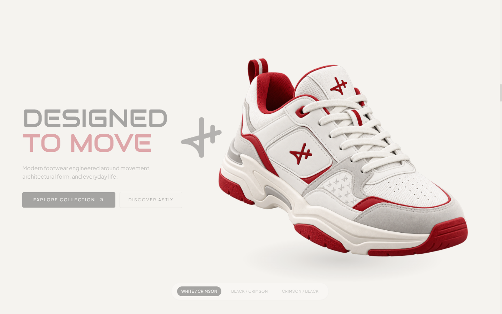
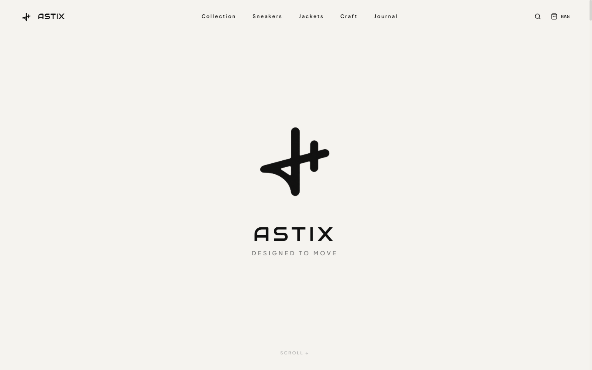
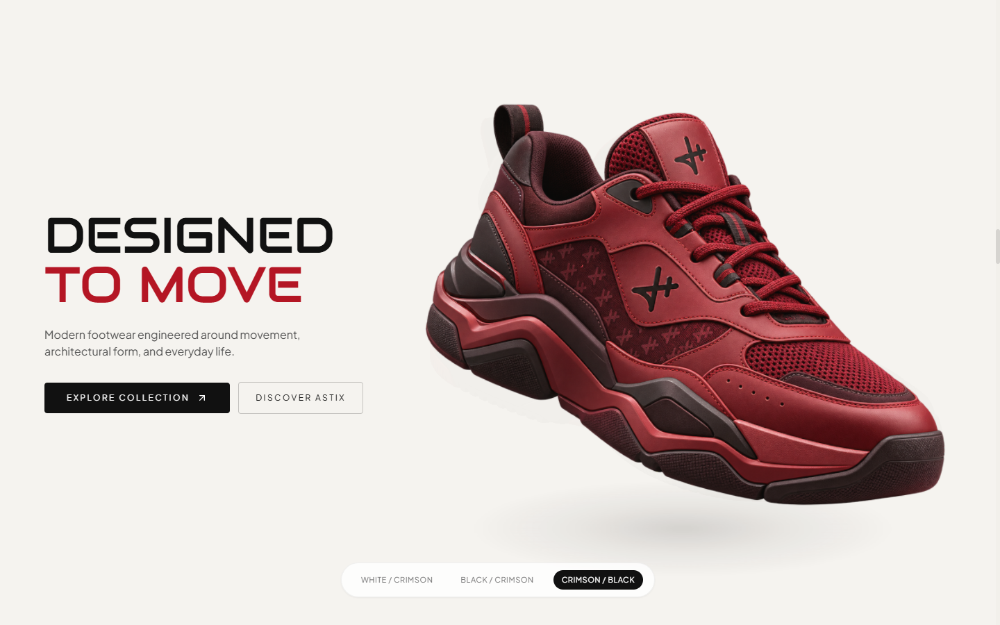
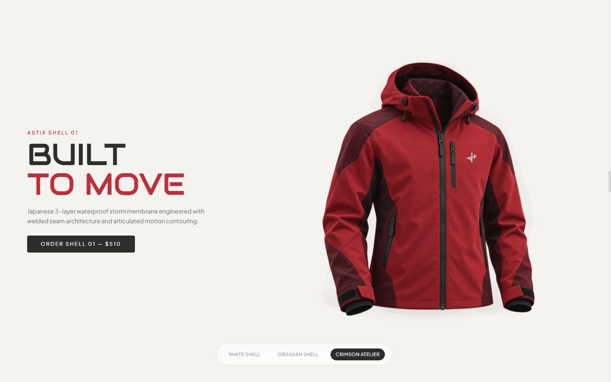
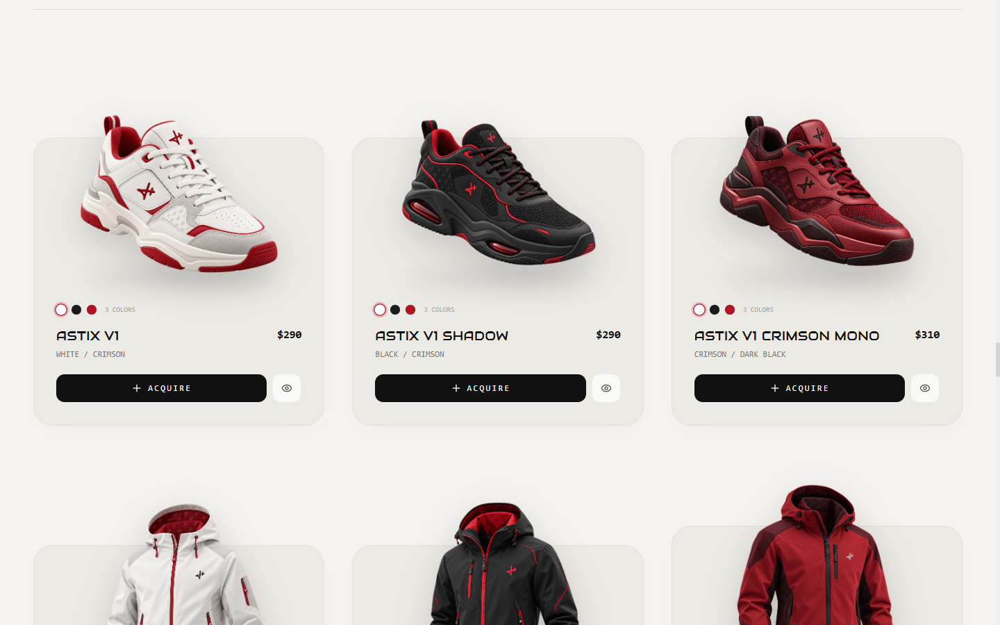

# ASTIX — Cinematic 3D Fashion E-Commerce Experience

[](LICENSE)
[](https://react.dev/)
[](https://www.typescriptlang.org/)
[](https://threejs.org/)
[](https://tailwindcss.com/)
[](https://vitejs.dev/)

> A production-quality, award-winning cinematic 3D fashion e-commerce experience for **ASTIX** — architectural footwear and technical storm shells engineered around human movement, material restraint, and contemporary visual culture.



---

## 📸 Visual Previews

Explore the core scenes and interactive transitions of the ASTIX digital experience:

| Scene / Section | Preview |
| :--- | :--- |
| **01. Brand Identity Viewport**<br>_Opening screen featuring the 3D ASTIX sculptural insignia and minimal editorial intro before product reveals._ |  |
| **02. Footwear Experience**<br>_3D white-and-crimson sneaker revealed at ~40% scroll with live colorway switching and dynamic studio lighting._ |  |
| **03. Technical Outerwear**<br>_Continuous, overlapping cinematic transition into the Obsidian Shell technical storm jacket._ |  |
| **04. Dimensional Card Overflow**<br>_Curated `#ECEAE5` luxury collection pedestals where product silhouettes break out 60–80px above card boundaries._ |  |
| **05. Material Science & Craft Details**<br>_Precision architectural typography, technical garment engineering, and tactile material specifications._ |  |

---

## ✨ Key Features

- **Brand-First Cinematic Introduction**: The experience opens intentionally with the sculptural ASTIX monogram and brand ethos. Products are held back until deliberate scroll engagement, establishing an editorial tone.
- **Continuous 3D Scroll Choreography**: Seamless, overlapping transitions between footwear and technical outerwear with unhurried pacing, depth-masking, and physical camera-like translation.
- **Audiowide Typography System**: Geometric headline architecture powered by Google Font `Audiowide`, paired with neutral high-density body typography.
- **Smart Auto-Hiding Navigation**: A refined glassmorphic top navigation bar that fluidly conceals when scrolling down and reappears upon upward scroll or reaching the top.
- **Dimensional Card Overflow**: E-commerce cards where product silhouettes naturally float beyond container borders with soft studio contact shadows.
- **Interactive Colorways**: Live 3D colorway switching across White, Obsidian, and Crimson Atelier editions with synchronized lighting updates.
- **Signature Footer Identity**: An exclusive handcrafted *"powered by astro"* signature styled with Google Font `Sacramento`.
- **Fluid Multi-Device Responsiveness**: Tuned layout mathematics across desktop ultra-wides, laptops, tablets, and mobile viewports.

---

## 🛠 Tech Stack

- **Core Framework**: React 18, TypeScript, Vite
- **3D Graphics & Canvas**: Three.js, Canvas WebGL
- **Styling & Design System**: Tailwind CSS
- **Motion & Smooth Scroll**: Lenis Smooth Scroll Engine
- **Icons**: Lucide React
- **Typography**: Google Fonts (`Audiowide`, `Sacramento`, `Inter`)

---

## 📁 Project Structure

```text
astix/
├── docs/
│   └── previews/               # High-resolution screenshots for documentation
│       ├── 01-brand-identity.png
│       ├── 02-sneaker-hero.png
│       ├── 03-jacket-hero.png
│       ├── 04-collection-cards.png
│       └── 05-craft-details.png
├── public/
│   └── images/                 # Transparent product renders & studio assets
├── scripts/
│   └── capture_previews.mjs    # Automated headless browser preview generator
├── src/
│   ├── components/             # UI and 3D scene modules
│   │   ├── BrandIntro.tsx      # Initial brand identity viewport
│   │   ├── Hero3D.tsx          # Three.js canvas & scroll-driven model renderer
│   │   ├── Header.tsx          # Auto-hiding responsive navigation bar
│   │   ├── Collection.tsx      # Product cards with overflow geometry
│   │   ├── CraftDetails.tsx    # Technical craftsmanship and specifications
│   │   └── Footer.tsx          # Minimal footer with Sacramento astro mark
│   ├── App.tsx                 # Root application orchestration
│   ├── main.tsx                # Application entry point
│   └── index.css               # Global typography, Tailwind, and custom rules
├── index.html                  # HTML entry with preloaded Google Fonts
├── package.json
├── tailwind.config.js
└── vite.config.ts
```

---

## 🚀 Getting Started

### Prerequisites

- [Node.js](https://nodejs.org/) (v18.0.0 or higher recommended)
- `npm`, `pnpm`, or `yarn`

### Installation

1. **Clone the repository:**
   ```bash
   git clone https://github.com/cyberuz001/astix.git
   cd astix
   ```

2. **Install project dependencies:**
   ```bash
   npm install
   ```

3. **Start the local development server:**
   ```bash
   npm run dev
   ```

4. **Build for production:**
   ```bash
   npm run build
   ```

5. **Locally preview production build:**
   ```bash
   npm run preview
   ```

---

## 📜 License

This project is licensed under the [MIT License](LICENSE).
